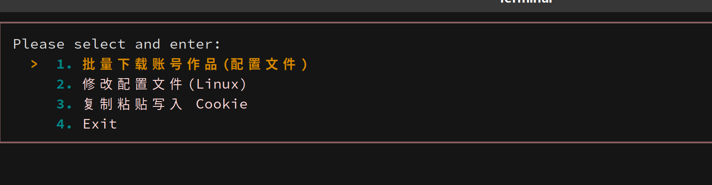
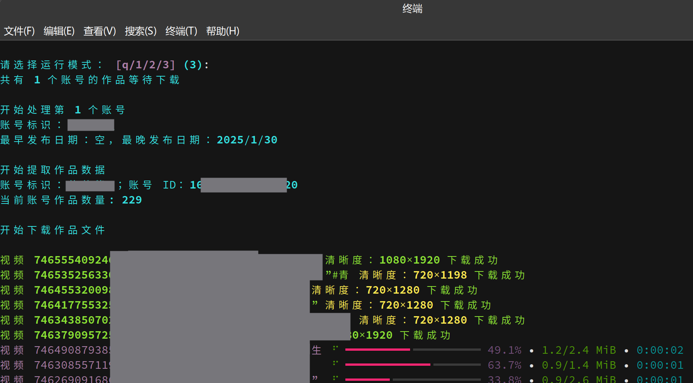

# Douyin Downloader

A Python-based tool to download videos and image collections from Douyin (Chinese TikTok) accounts. Built with Python 3.12 and optimized for concurrent downloads.

## Features

- 🎬 **Concurrent Downloads**: Download videos and image collections using 5 concurrent coroutines for faster processing
- ⚙️ **Flexible Configuration**: Configure download preferences through JSON settings files
- 📅 **Date Range Filtering**: Download content within a specific date range
- 🎯 **Multi-Account Support**: Download from multiple Douyin accounts in a single run
- 🏷️ **Custom Naming**: Customize file naming using create_time, video ID, type, and description
- 💾 **Cache Support**: Resume downloads from cache and continue interrupted downloads

## Screenshot of Running




## Requirements

- Python 3.12+
- Dependencies (see `requirements.txt`):
  - `aiohttp==3.13.0` - Async HTTP client
  - `mini_racer==0.14.1` - JavaScript runtime
  - `prompt_toolkit==3.0.52` - Interactive CLI
  - `Requests==2.34.2` - HTTP requests
  - `rich==15.0.0` - Rich terminal output
  - `yarl==1.22.0` - URL handling

## Installation

1. Clone the repository:
```bash
git clone <repository-url>
cd douyin_download
```

2. Install dependencies:
```bash
pip install -r requirements.txt
```

## Configuration

### Quick Start

1. Edit `settings_default.json`
2. Modify the configuration according to your needs
3. Run the program:
```bash
python run.py
```

### Configuration File (settings.json)

#### Required Parameters

| Parameter | Description | Example |
|-----------|-------------|---------|
| `accounts` | Array of Douyin accounts to download | See example below |
| `mark` | Account identifier (can be empty string) | `"my_account"` |
| `url` | Account homepage URL (must be desktop web version) | `"https://www.douyin.com/user/..."` |
| `earliest` | Earliest publication date to download (default: 2016/9/20) | `"2024/01/01"` |
| `latest` | Latest publication date to download (default: yesterday) | `"2025/12/31"` |

**Important**: Cookies are required but configured automatically by the program. You can copy cookies from your browser as shown in the images folder.
 

#### Optional Parameters

| Parameter | Description | Default | Example |
|-----------|-------------|---------|---------|
| `save_folder` | Download destination folder | Project root | `"douyin/my_folder"` |
| `download_videos` | Enable video download | `true` | `true` |
| `download_images` | Enable image collection download | `true` | `true` |
| `download_horizontal_video` | Download landscape videos | `true` | `true` |
| `download_vertical_video` | Download portrait videos | `true` | `true` |
| `name_format` | File naming format | `["create_time", "id"]` | `["create_time", "id", "desc"]` |
| `split` | Separator between name components | `"-"` | `"_"` |
| `date_format` | Date format in filenames | `"%Y-%m-%d"` | `"%Y/%m/%d"` |
| `add_account_mark_to_end_of_name` | Append account mark to filename | `false` | `true` |

### Configuration Example

```json
{
    "accounts": [
        {
            "mark": "creator1",
            "url": "https://www.douyin.com/user/...",
            "earliest": "2024/01/01",
            "latest": "2025/12/31"
        },
        {
            "mark": "creator2",
            "url": "https://www.douyin.com/user/...",
            "earliest": "2023/06/01",
            "latest": "2025/12/31"
        }
    ],
    "save_folder": "downloads",
    "download_videos": true,
    "download_images": true,
    "name_format": ["create_time", "id", "desc"],
    "split": "-",
    "date_format": "%Y-%m-%d"
}
```

## Usage

### Basic Usage

```bash
python run.py
```

The program will:
1. Read configuration from `settings_default.json`
2. Prompt for browser cookies if not cached
3. Fetch account information
4. Download videos and images concurrently (5 concurrent downloads)
5. Display progress with rich terminal output

### Project Structure

```
douyin_download/
├── src/
│   ├── scheduler.py          # Main scheduler/coordinator
│   ├── downloader/           # Download logic
│   ├── requester/            # API request handling
│   ├── config/               # Configuration management
│   ├── cache/                # Caching functionality
│   └── encrypt_params/       # Parameter encryption
├── run.py                    # Entry point
├── requirements.txt          # Python dependencies
├── settings_default.json     # Default configuration template
└── README.md                 # Chinese documentation
```

## Notes

- **Video Format**: For `.dash` videos, the tool renames them to `.mp4` (actual format validation pending)
- **Cookies**: Browser cookies are automatically managed by the program
- **Concurrent Limit**: Fixed at 5 concurrent downloads for stability
- **Date Format**: Use the format specified in configuration, default is `YYYY-MM-DD`

## Disclaimer

- This project is for learning and research purposes only
- Not intended for commercial or illegal use
- Users are responsible for all legal consequences of using this tool
- Users must comply with Douyin's Terms of Service
- If your intellectual property rights or privacy are violated, please contact us immediately
- By using this project, you agree to all terms in this disclaimer

## References

- [TiktokDouyinCrawler](https://github.com/NearHuiwen/TiktokDouyinCrawler)
- [TikTokDownloader](https://github.com/JoeanAmier/TikTokDownloader)
- [f2](https://github.com/Johnserf-Seed/f2)
- [TikTokDownload](https://github.com/Johnserf-Seed/TikTokDownload)
- [Douyin_TikTok_Download_API](https://github.com/Evil0ctal/Douyin_TikTok_Download_API)
- [DouyinLiveRecorder](https://github.com/ihmily/DouyinLiveRecorder)
- [httpx](https://github.com/encode/httpx/)
- [rich](https://github.com/Textualize/rich)
- [FFmpeg](https://ffmpeg.org/ffmpeg-all.html)

## License

This project is provided as-is for educational and research purposes.

---

**Original Documentation**: See [README.md](README.md) for Chinese documentation
