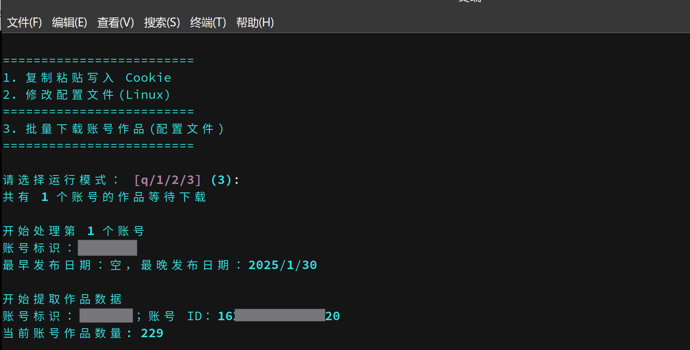
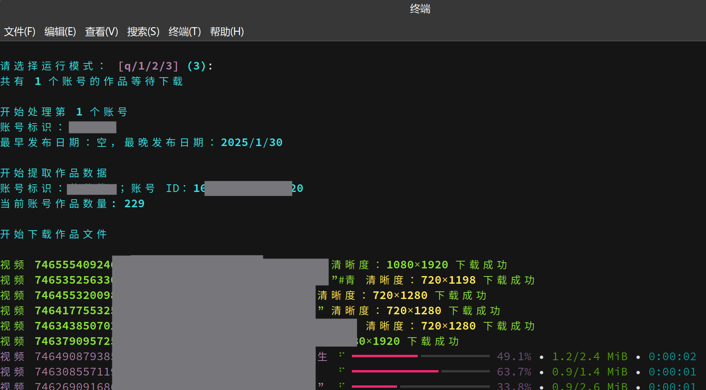
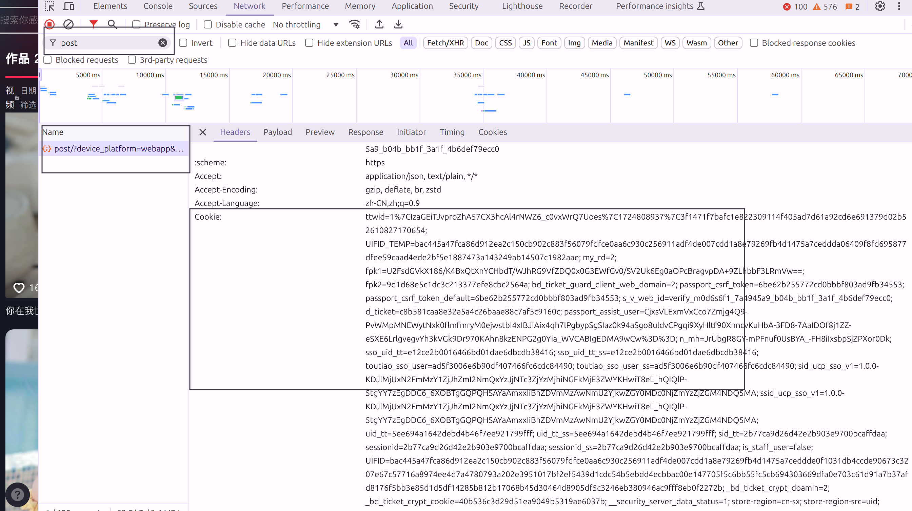

# DouYinDownload

本项目基于 Python 3.12

## 项目功能

1. 使用协程下载视频与图集（协程数为 5）
2. 配置文件可设置是否下载视频、是否下载图集。
3. 使用配置文件连续下载多个帐号视频。

### 运行截图

## 配置文件说明 (settings_default.json)

### 必要参数

| 条目            | 说明                                                                                                 |
| --------------- | ---------------------------------------------------------------------------------------------------- |
| accounts        | 要下载的帐号信息，可添加多个帐号                                                                     |
| mark            | 账号标识，可以设置为空字符串                                                                         |
| url             | 账号主页链接（必须为电脑网页端链接）                                                                 |
| earliest        | 要下载的作品最早发布日期（默认为 2016/9/20）                                                         |
| latest          | 要下载的作品最晚发布日期（默认为 前一天日期）                                                        |

- **注意**：cookies 为必要参数，但不需要通过配置文件修改，而是通过程序运行自动配置。可根据下图从浏览器复制
 

### 可选参数

| 条目            | 说明                                                                                                 | json 配置示例 |
| --------------- | ---------------------------------------------------------------------------------------------------- | --------------------- |
| save_folder     | 下载视频存储文件夹（默认为项目根目录）                                                               | "save_folder": "douyin/my_folder" |
| download_videos | 设置为 false，则不下载视频                                                                         | "download_videos": false |
| download_images | 设置为 false，则不下载图集                                                                         | "download_images": false |
| name_format     | 下载的视频命名格式（可选项：create_time(视频发布日期) id(视频 id) type(图集/视频) desc(视频描述文本) | "name_format": [ "create_time", "id" ] |
| split           | 上述 “name_format” 不同项间的间隔符（默认为 “-”）                                                    | "split": "-" |
| date_format     | 上述 “name_format” 中日期格式（默认为 “%Y-%m-%d”(年月日)）                                           | "date_format", "%Y-%m-%d" |
| proxy  | 网络代理（若使用 clash 的 Tun 模式，就需要这个参数）| "proxy": "<http://127.0.0.1:7897>" |

## 免责声明 (Disclaimer)

- 本项目仅用于学习和研究使用，不得用于任何商业和非法目的。使用本项目提供的功能，用户需自行承担可能带来的一切法律责任。

- 使用本项目的内容，即代表您同意本免责声明的所有条款和条件。如果你不接受以上的免责声明，请立即停止使用本项目。

- 如有侵犯到您的知识产权、个人隐私等，请立即联系我们， 我们将积极配合保护您的权益。

## 项目参考 (Refer)

- <https://github.com/NearHuiwen/TiktokDouyinCrawler>
- <https://github.com/JoeanAmier/TikTokDownloader>
- <https://github.com/Johnserf-Seed/f2>
- <https://github.com/Johnserf-Seed/TikTokDownload>
- <https://github.com/Evil0ctal/Douyin_TikTok_Download_API>
- <https://github.com/NearHuiwen/TiktokDouyinCrawler>
- <https://github.com/ihmily/DouyinLiveRecorder>
- <https://github.com/encode/httpx/>
- <https://github.com/Textualize/rich>
- <https://github.com/omnilib/aiosqlite>
- <https://github.com/borisbabic/browser_cookie3>
- <https://github.com/pyinstaller/pyinstaller>
- <https://ffmpeg.org/ffmpeg-all.html>
- <https://html5up.net/hyperspace>
